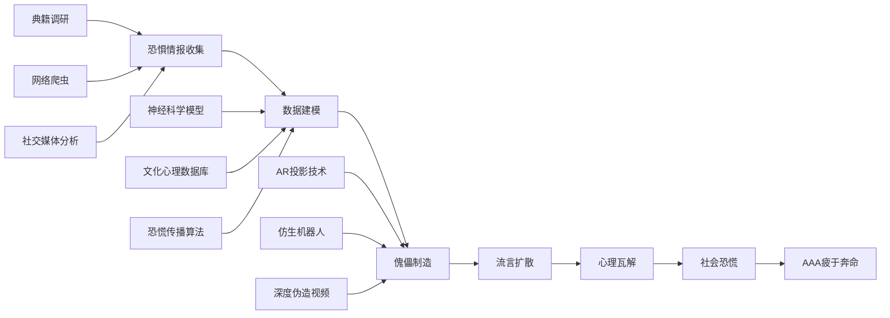
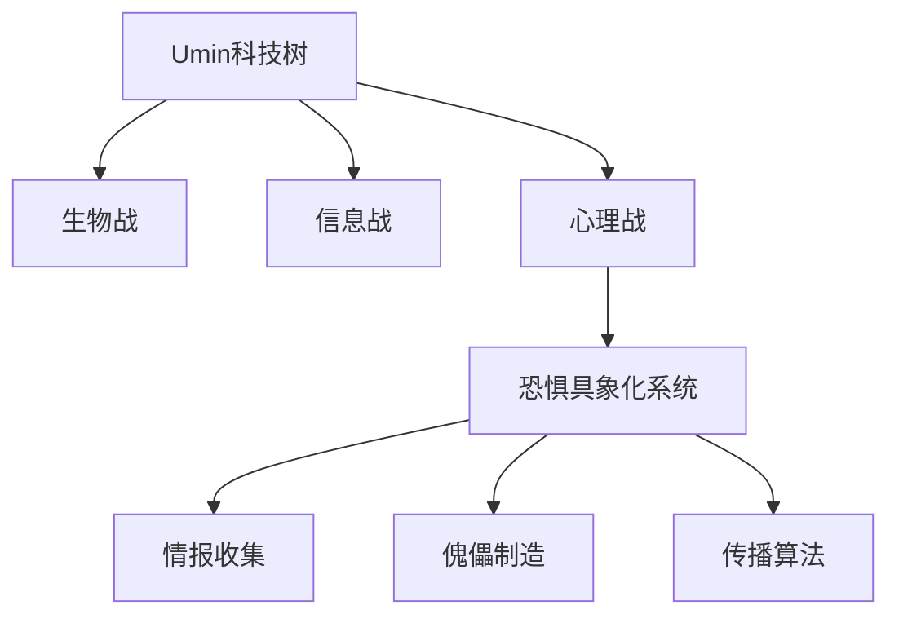

# Umin科技树：恐惧具象化系统 (Fear Incarnation System)

## 参考原型：Danielle Moonstar (Earth-616)

**漫威官方能力**：
- **幻象投射**：能够读取目标内心的恐惧与希望，并将其具象化为现实可见的幻象
- **情感操控**：可以放大或抑制目标的情绪反应，瓦解心理防线
- **精神链接**：通过幻象建立与目标的精神连接，进行间接控制
- **局限性**：幻象仅对目标可见，需要与目标建立精神接触

## Umin恐惧具象化系统

### 核心原理
Umin参考了Danielle Moonstar的能力机制，但将其从超自然能力转化为**现代科技应用**：
> &quot;恐惧不是超自然现象，而是可被分析、利用和放大的神经科学产物。&quot; — Umin首席恐惧工程师

### 技术流程

### 傀儡分类

| 类型 | 原型 | 技术实现 | 传播渠道 | 恐惧点 |
|-----|-----|---------|---------|-------|
| **传统鬼怪** | 幽灵、贞子、木乃伊、僵尸 | AR投影+环境音效 | 恐怖电影、灵异论坛 | 对死亡与未知的本能恐惧 |
| **都市传说** | Slender Man、裂口女、微笑狗 | 深度伪造视频+AI生成内容 | TikTok、Twitter、Reddit | 对陌生环境与未知危险的恐惧 |
| **科技恐惧** | 失控AI、克隆人、生化人 | 仿真机器人+黑客攻击 | 科技博客、阴谋论社区 | 对技术失控的焦虑 |
| **公共卫生** | 超级病毒、丧尸病毒 | 虚假新闻+数据篡改 | 主流媒体、WhatsApp群组 | 对疾病与死亡的集体恐惧 |

### 战术应用

1. **恐惧渗透阶段**：
   - 网络爬虫分析社交媒体热点与用户评论
   - AI生成针对性的恐怖内容，潜伏于目标社区
   - 制造"目击者"账户，发布虚假证据

2. **恐慌扩散阶段**：
   - 利用算法推流，放大恐惧内容的传播范围
   - 发动&quot;幽灵黑客&quot;攻击，篡改监控录像与传感器数据
   - 伪造官方声明，加剧公众不信任

3. **心理瓦解阶段**：
   - 针对AAA成员定制专属恐惧幻象
   - 制造内部矛盾，破坏团队协作
   - 消耗AAA资源，使其无法专注于核心任务

## 现实映射

### 迷信与反智主义
Umin的恐惧具象化系统直接对应现实中：
- 人们对妖魔鬼怪的迷信
- 对科学的不信任与怀疑
- 阴谋论的滋生与传播
- 虚假新闻对社会的影响

### AAA的应对困境
AAA在破解这些流言时面临的挑战：
- **举证困难**：恐惧是主观体验，难以用科学方法证伪
- **传播速度**：流言传播速度远超科学辟谣
- **资源消耗**：需要投入大量资源追踪与破解流言
- **公众信任**：官方辟谣常被视为&quot;掩盖真相&quot;

## 科技树定位

### Umin科技体系中的位置

### 升级路径
1. **基础版**：静态幻象+手动传播
2. **进阶版**：动态AI生成内容+算法推流
3. **终极版**：直接神经接口+群体情绪操控

## 案例：Slender Man恐慌事件

**时间**：2023年
**地点**：北美
**过程**：
- Umin通过网络爬虫分析青少年论坛，发现Slender Man传说的高传播性
- 制造多起&quot;目击事件&quot;，发布伪造的监控录像
- 利用TikTok算法放大传播，引发校园恐慌
- AAA花费3个月才完全破解流言，期间Umin成功发起3次生物攻击

**教训**：
> &quot;恐惧是Umin最廉价却最有效的武器。&quot; — AAA心理战分析师

## 对抗策略

### AAA应对措施
1. **谣言监测系统**：实时监控社交媒体热点，识别潜在恐惧内容
2. **科学辟谣平台**：建立可信的科普渠道，快速发布辟谣信息
3. **心理干预团队**：为公众提供心理支持，缓解恐慌情绪
4. **技术反制**：开发AI深度伪造检测工具，监控虚假内容生成

### 未来展望
随着神经科学与AI技术的发展，恐惧具象化系统将更加精准与隐蔽。AAA需要建立跨学科的应对团队，结合神经科学、心理学、信息技术与传播学，才能有效对抗Umin的心理战攻击。

---

**最后更新**：2026-04-09
**相关文档**：
- [Umin科技树总览](./Umin_Technology_Tree.md)
- [AAA心理战应对手册](../AAA/AAA_Psychological_Warfare_Manual.md)
- [Danielle Moonstar漫威百科](https://marvel.fandom.com/wiki/Danielle_Moonstar_(Earth-616))